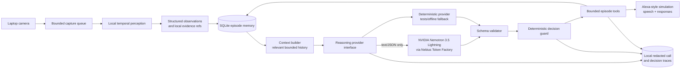

# NVIDIA/Nebius submission plan

Status: implementation plan, prepared October 8, 2026

Target repository: `digital-hippocampus-nvidia`

Target track: Personal AI

Supplied deadline: October 30, 2026 at 6:00 PM WAT

This plan reuses the shared Digital Hippocampus live perception, persistent episode memory,
activity states, speech/text interaction, and tea demonstration. The competition fork begins
only after the shared live-memory core is stable. Robotics frameworks and additional hosted
infrastructure are out of scope unless an evaluated requirement makes them necessary.

## Outcome and acceptance criteria

The submission will demonstrate a personal assistant that observes locally, remembers an
activity across interruptions, and asks an NVIDIA Nemotron model served by Nebius to propose a
bounded next action. Application code—not the model—enforces timing, duplicate prevention,
permissions, terminal states, and caregiver limits. The model sees structured observations and
episode history, not raw video.

The integration is accepted when:

- a configurable `ReasoningProvider` supports both a deterministic local implementation and a
  Nebius-hosted NVIDIA implementation;
- a startup preflight proves that the selected model ID is present on the configured Nebius
  endpoint and a captured trace proves that the model actually handled the demo request;
- every provider output is schema-validated before it can reach a tool or state transition;
- malformed, unavailable, slow, or policy-violating model output fails safely to a deterministic
  wait/no-action path;
- an auditor can connect input observations to a model proposal, guard decision, tool call, and
  resulting episode transition;
- tests and evaluation cover interruption, completion, early return, occlusion, camera failure,
  snooze, duplicate suppression, provider failure, and restart behavior;
- the repository documents the exact fields sent to Nebius and keeps raw recordings local by
  default;
- the public repository contains an appropriate license, reproducible setup/run instructions,
  results, limitations, genuine platform feedback, a competition change log, and a public
  YouTube demo no longer than three minutes.

## Shared-core gate before the fork

The current baseline already implements bounded asynchronous capture, timestamped observations,
temporal tea evidence, SQLite episodes/transitions/evidence/check-ins, browser speech and text
responses, duplicate/cooldown guards, and preview-only caregiver escalation. Preserve these
behaviors and tests.

Before creating `digital-hippocampus-nvidia`:

1. Pass the existing Python and JavaScript checks documented in `docs/live-demo.md`.
2. Rehearse camera, speech synthesis, and speech recognition on the demo laptop.
3. Freeze versioned `ObservationEnvelope`, `EpisodeSnapshot`, and `ReasoningDecision` schemas.
4. Add a provider-neutral decision boundary without changing local policy outcomes.
5. Record the exact shared-core commit SHA used to create the competition repository.

Competition-specific credentials, model prompts, evaluation artifacts, and presentation changes
stay in the fork. General provider and trace interfaces may be contributed back to the shared
core only if their default implementation remains local and deterministic.

## Verified model and provider choice

The initial provider will use Nebius Token Factory's OpenAI-compatible inference API with:

```text
Provider: Nebius Token Factory
Base API: https://api.tokenfactory.nebius.com/v1/
Model ID: nvidia/Nemotron-3_5-Lightning
Credential: NEBIUS_API_KEY (server-side environment only)
```

This candidate was checked on October 8, 2026 against Nebius's official Nemotron page, which
lists the exact model ID, a public endpoint, and agentic reasoning/tool-use positioning. Nebius's
official API schema exposes `/v1/models`, `/v1/chat/completions`, and `/v1/responses`. NVIDIA's
model material describes Nemotron 3.5 Lightning as a 30B hybrid mixture-of-experts model with 3B
active parameters intended for agent workloads.

Treat it as a text reasoning model in this application. The NVIDIA model card identifies text
output; neither that fact nor the general availability of multimodal Nemotron variants proves
that this exact Nebius endpoint accepts images. The provider therefore sends structured text/JSON
only. No image, video, or audio input will be added unless the exact deployed model's official
Nebius catalog entry and a canary test both verify that capability.

Before every demo/evaluation environment is accepted, run a preflight that:

1. calls `GET /v1/models` and saves a sanitized response proving the exact model ID is available;
2. sends a minimal text canary and records provider, model, response ID, latency, and usage;
3. exercises the proposed structured-output/tool-call shape against the live endpoint;
4. verifies timeout and rate-limit handling;
5. records the applicable NVIDIA model terms and Nebius service terms in the dependency audit.

If the ID or required behavior is unavailable, fail startup with a clear message. Do not silently
substitute another model. A replacement requires a new official-document review, evaluation
comparison, and recorded plan decision.

## Architecture

Keep the server-side reasoning integration inside the existing Python backend. This satisfies the
credential boundary without adding a new web service: browser JavaScript never receives the API
key, and raw camera media stays in the local evidence store.



Raw recordings, evidence JPEGs, and object-detector tensors do not cross the Nebius boundary.
The API call is made from the backend process using a short timeout and bounded retry policy.
Model failure cannot stop camera capture, corrupt durable state, or authorize a reminder.

## Reasoning-provider contract

Introduce a small provider interface rather than coupling episode logic to an SDK:

```python
class ReasoningProvider(Protocol):
    name: str

    def decide(self, context: ReasoningContext) -> ReasoningDecision:
        ...
```

Implementations:

- `DeterministicReasoningProvider`: mirrors the current policy for unit tests, offline demos, and
  a safe fallback. It makes no network request.
- `NebiusNemotronProvider`: converts the same context to a bounded prompt/request, calls the exact
  configured model, parses the response, and returns only a validated decision.

`ReasoningContext` contains a versioned, size-bounded snapshot:

- episode ID, activity type, current state, state version, and activity confidence;
- current time, configured thresholds, reminder count, cooldown, and snooze deadline;
- recent structured observations with timestamp, source, confidence, camera/scene quality, and
  evidence ID/hash;
- only transitions relevant to the current decision, with reason codes and evidence references;
- outstanding check-in metadata, if any;
- a user response transcript only when response interpretation is needed;
- the exact allowed-action list and the facts/permissions required for each action.

`ReasoningDecision` is a strict Pydantic/JSON Schema object:

```json
{
  "schema_version": "1.0",
  "episode_id": "...",
  "episode_version": 7,
  "action": "wait",
  "evidence_ids": ["..."],
  "confidence": 0.82,
  "reason_code": "INSUFFICIENT_USABLE_ABSENCE",
  "reason_summary": "More clear observations are needed.",
  "parameters": {}
}
```

Do not request or log hidden chain-of-thought. Require a short reason code/summary tied to supplied
evidence. Reject unknown fields, actions, IDs, enum values, stale episode versions, unbounded
durations, and references to evidence outside the provided context.

## Supported actions and application-owned tools

The model may propose only these actions:

| Proposed action | Application tool | Mandatory guard |
| --- | --- | --- |
| `request_additional_observations` | update a bounded observation-request hint | requested signal is supported; no arbitrary capture/upload |
| `wait` | record decision only | always safe; no state regression |
| `propose_checkin` | create a check-in and move to `awaiting_response` | sufficient activity, sustained usable absence, no completion, timer due, no duplicate, cooldown clear |
| `interpret_response` | map transcript to supported intent | an outstanding check-in exists; transcript is current; confidence threshold met |
| `snooze` | move to `snoozed` and set deadline | authenticated current response requested it; duration within configured bounds |
| `close_episode` | complete or dismiss with an explicit source | supported close reason; user-confirmed status requires matching current user input |

The model does not directly mutate the database. `DecisionGuard` checks current persisted state in
the same transaction/idempotency scope before `EpisodeToolExecutor` acts. The application's
clock, state machine, thresholds, response permissions, notification counts, and caregiver policy
remain authoritative.

Specific safety behavior:

- camera unavailability, stale frames, or occlusion cannot accumulate confirmed departure time;
- a model cannot relabel visually inferred completion as user-confirmed completion;
- one policy window has one idempotency key, so retries cannot create duplicate reminders;
- terminal `completed` and `dismissed` episodes reject further reminder actions;
- caregiver delivery remains local preview by default. A future real adapter still requires
  explicit opt-in, a selected recipient, an escalation delay, and a hard notification limit;
- model-supplied message text is not sent externally. User-visible prompts come from grounded,
  reviewed templates populated from the saved episode.

## Exact Nebius data boundary

For every live call, offer a developer-mode payload preview showing what will leave the machine.
The competition documentation will list these fields, not merely say that data is “anonymized.”

Sent to Nebius:

- system instruction describing the schema, allowed actions, and uncertainty rules;
- pseudonymous run/episode IDs and schema/config versions;
- activity label, state, confidence, timers, reminder count, and completion source;
- selected structured observations such as object labels, normalized coordinates, motion/quality
  numbers, camera state, timestamps relative to the episode, and source confidence;
- selected transition reason codes and short summaries;
- opaque evidence IDs and SHA-256 values, which prove linkage but cannot fetch local media;
- the current user response text only when the model is asked to interpret it;
- the strict response/tool schema.

Not sent to Nebius:

- raw video, evidence images, audio recordings, detector tensors, or face crops;
- local filesystem paths or camera URLs;
- face embeddings, biometric identity claims, inferred health/safety status, or water temperature;
- the person's spoken/display name when local prompt templating can add it after the decision;
- caregiver contact information, API keys, environment variables, or unrelated episode history.

Common commands such as “Give me another minute,” “I'm done,” and “Cancel” are interpreted by the
local high-confidence parser first. Calling Nebius for ambiguous responses is an evaluated option,
not a requirement to upload every transcript. Document transcript retention separately from visual
evidence retention.

## Call, decision, and workflow traces

Add append-only `reasoning_calls`, `reasoning_decisions`, and `agent_tool_calls` records to SQLite.
Each provider call records:

- call/correlation ID, episode ID/version, provider, base hostname, exact model ID, and timestamp;
- prompt/schema/config version, referenced observation/evidence IDs, and a canonical input hash;
- a locally stored redacted request payload sufficient to reproduce the call;
- response ID, raw structured response or parse failure, token usage, latency, and retry count;
- validated decision or validation errors;
- guard outcome and reason, tool invocation/result, state before/after, and idempotency key.

Secrets and authorization headers are never logged. Free-form user text is marked sensitive and
can be removed while preserving its hash and interpreted intent in exported traces. Trace export
must redact configured sensitive fields and run a secret scan before producing submission assets.

The dashboard will show a compact decision chain:

```text
observations/evidence -> Nemotron proposal -> application guard -> tool call -> episode state
```

Required proof includes at least one real Nebius call that changes the next workflow step and one
proposal rejected by an application guard. The final video shows provider/model identification,
correlation IDs, and sanitized input/output—not the API key or private chain-of-thought.

## Implementation sequence

### Phase 0 — finish and freeze the shared core (October 8–12)

- Complete the shared-core gate and hardware rehearsal.
- Add provider-neutral schemas and trace hooks only where they are broadly useful.
- Checkpoint: all current behavior remains available with the deterministic provider and no key.

### Phase 1 — create the public competition fork (October 13)

- Create `digital-hippocampus-nvidia` from the recorded shared-core SHA.
- Add `LICENSE` using Apache-2.0 for project code, plus dependency/model notices after license
  review. Do not imply that the project license changes third-party model/service terms.
- Add `.env.example`, secret scanning, contribution notes, and a significant-changes log.
- Checkpoint: a clean clone runs the offline demo and tests without credentials.

### Phase 2 — provider interface and validation (October 14–16)

- Implement provider/config selection, bounded contexts, strict response schema, and safe fallback.
- Unit-test every allowed action and malformed/hostile/unknown output case.
- Keep existing policy code as `DecisionGuard`; do not move safety conditions into prompts.
- Checkpoint: provider contract tests give the same state-machine invariants for local and mocked
  Nebius providers.

### Phase 3 — live Nebius integration and traces (October 17–19)

- Implement authenticated OpenAI-compatible calls with timeouts, limited retry/backoff, and
  startup preflight.
- Capture a sanitized `/v1/models` artifact and real canary/result trace for the exact model.
- Add trace persistence, trace export, and the UI decision chain.
- Checkpoint: a live Nemotron call proposes a valid action and the guarded tool result is visible.

### Phase 4 — workflow evaluation and privacy review (October 20–23)

- Run the required scenario matrix using replay fixtures, then repeat on the live camera.
- Test provider timeout, rate limit, invalid JSON/schema, stale episode version, duplicate proposal,
  prompt injection inside observation labels/transcripts, restart, and network recovery.
- Inspect the payload preview and exported traces for raw media, secrets, local paths, and contact
  data.
- Checkpoint: publish raw aggregate results, failed cases, actual latency/token/cost measurements,
  and known limitations.

### Phase 5 — reproducibility and submission assets (October 24–27)

- Rebuild from a clean clone and execute the documented setup, live, replay, and evaluation paths.
- Complete architecture, data-flow, setup/run, evaluation, limitation, and genuine-feedback docs.
- Freeze significant competition changes relative to the shared-core SHA.
- Checkpoint: a second person can reproduce the test build using only public docs and their own
  credential.

### Phase 6 — record and submit with buffer (October 28–30)

- Record and publish the YouTube demo at no more than three minutes.
- Complete the final rules/model-availability/license check and public-repository audit.
- Target final submission by October 29, retaining a full day before the supplied October 30,
  6:00 PM WAT deadline.

The deadline and track were supplied for this plan and must be checked against the official
competition page before the feature freeze and again before submission.

## Evaluation protocol

Use timestamped observation replay fixtures for repeatability, clearly labelled as fixtures rather
than live inference. Run the same state and safety assertions with both the deterministic provider
and the live Nebius provider. Complete at least ten fixed-fixture trials per scenario plus three
live-camera rehearsals per core scenario; publish the actual counts and every failure.

| Scenario | Required evidence/condition | Required outcome |
| --- | --- | --- |
| Interrupted activity | sufficient preparation evidence followed by sustained usable absence | one guarded check-in proposal/action, no duplicate |
| Completed activity | saved visual completion evidence before departure | no check-in; source stays `visually_inferred` unless user confirms |
| Early return | renewed person/activity evidence before threshold | resume/cancel pending path, no check-in |
| Occlusion | unusable blur/dark/blocked frames | request clearer evidence or wait; do not count departure |
| Camera failure | unavailable/read-failure observations | wait/degraded status; do not count departure or escalate |
| Snooze | current user asks for another minute | one bounded snooze, no reminder until due |
| User completion/dismissal | current response maps to done/cancel | terminal state with correct source; no further reminder |
| Provider failure | timeout, 429, malformed or schema-invalid output | deterministic safe wait/fallback, persisted diagnostic |
| Duplicate/stale proposal | repeated call or old episode version | guard rejects; state and notification count unchanged |
| Restart | outstanding/closed episode restored | no replay of an already delivered notification |

Report:

- valid-schema rate, action agreement with a reviewed expected outcome, guard rejection rate, and
  end-to-end scenario success rate;
- false check-ins and missed eligible check-ins by scenario;
- duplicate reminders, terminal-state violations, and safety-guard violations (target: zero);
- provider p50/p95 latency, timeout/rate-limit counts, prompt/completion tokens, and actual cost;
- capture-to-decision latency and any effect of the model call on responsiveness;
- context size/history truncation, evidence-reference accuracy, and response-intent accuracy;
- deterministic-versus-Nemotron comparison, including cases where the model adds no value.

Prompts and thresholds are frozen before the final evaluation fixture set. Failed runs remain in
the report; do not select only successful traces.

## Repository and documentation deliverables

The public target repository will include:

- Apache-2.0 project license, third-party notices, and a model/service terms note;
- dependency lock file, supported Python version, and clean setup instructions;
- `.env.example` documenting `DIGITAL_HIPPOCAMPUS_REASONING_PROVIDER`, `NEBIUS_API_KEY`,
  `NEBIUS_BASE_URL`, `NEBIUS_MODEL`, request timeout, and explicit telemetry/data controls;
- commands for offline/local, live Nebius, replay, tests, evaluation, and sanitized trace export;
- architecture/data-boundary diagrams and a payload example with every outbound field;
- model preflight/capability proof and sanitized real-call evidence;
- evaluation fixtures where redistribution is permitted, aggregate outputs, and limitations;
- `docs/competition-changes.md` comparing the fork to its shared-core SHA;
- `docs/platform-feedback.md` recording genuine setup, API, docs, model-behavior, latency, and
  debugging experience, including unresolved friction;
- public YouTube link, transcript/captions, and a demo outline no longer than three minutes.

Suggested video outline (maximum 3:00):

1. `0:00–0:20` — Personal AI problem, local-media privacy boundary, simulation label.
2. `0:20–0:45` — architecture and proof of exact NVIDIA model served through Nebius.
3. `0:45–1:40` — interrupted tea episode, Nemotron proposal, guarded tool call, spoken check-in.
4. `1:40–2:05` — user response/snooze or return, persisted evolving memory.
5. `2:05–2:35` — completion/occlusion/camera-failure evaluation and safe rejections.
6. `2:35–3:00` — exact data sent, limitations, genuine platform feedback, and impact.

## Risks and explicit limitations

- Model availability, ID spelling, capabilities, price, and service behavior can change. The
  startup preflight and final official-doc check are release gates.
- The provider is text-only in this design. Semantic mistakes in upstream visual observations
  will constrain its decisions; the model never sees pixels to correct them.
- The current tea recognizer is narrow and rule-supported, not general activity understanding.
- Non-detection is not confirmed absence, and visually inferred completion is not user-confirmed.
- An LLM can be inconsistent, overconfident, or vulnerable to untrusted text. Strict schemas,
  bounded context, application guards, idempotency, and red-team fixtures limit the impact but do
  not make its reasoning inherently reliable.
- Browser speech support varies; text and quick actions remain the dependable fallback.
- This is a personal-memory demonstration, not a medical, emergency, or appliance-safety system.
- Do not add LangChain, robotics middleware, a vector database, Kubernetes, or a hosted backend
  unless measured requirements cannot be met by the provider adapter, SQLite, and current server.

## Official implementation references

- [Nebius NVIDIA Nemotron inference](https://nebius.com/services/token-factory/models/nvidia-nemotron-models-inference)
- [Nebius OpenAI-compatible API schema](https://api.tokenfactory.nebius.com/docs)
- [Nebius Token Factory](https://nebius.com/services/token-factory)
- [NVIDIA Nemotron 3.5 Lightning technical overview](https://developer.nvidia.com/blog/nvidia-nemotron-3-5-lightning-delivers-fast-accurate-specialized-task-execution-for-long-running-agents/)
- [NVIDIA Nemotron model resources](https://developer.nvidia.com/topics/ai/nemotron)

Revalidate all time-sensitive model, endpoint, pricing, licensing, and competition facts at the
preflight/freeze gates. The saved live traces, not a documentation claim, are the final evidence
that the NVIDIA model ran through Nebius and influenced the workflow.
