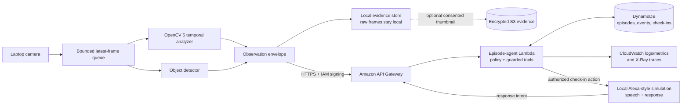

# OpenCV submission plan

Status: implementation plan, prepared October 8, 2026

Target repository: `digital-hippocampus-opencv`

Submission targets: main competition and Agentic Vision award

Deferred: optional COOL integration

This is a competition-specific branch plan, not a replacement for the shared Digital
Hippocampus core. The fork starts only after the current live-memory baseline is stable:
responsive capture, temporal observations, evolving episodes, SQLite persistence, spoken
check-ins, response handling, and the local-only caregiver preview must continue to work.

## Outcome and acceptance criteria

The submission will show a live laptop camera observing tea preparation, OpenCV 5 deriving
useful temporal signals, and an AWS-hosted episode agent updating durable memory and deciding
whether a grounded check-in is allowed. A judge must be able to follow a frame/evidence ID
through OpenCV output, an episode update, an agent decision, a guard result, and (when due) a
single spoken check-in.

The integration is accepted when all of the following are true:

- the installed Python distribution is exactly `opencv-python==5.0.0.93`, and startup fails
  closed unless the linked OpenCV runtime reports `5.0.0`;
- OpenCV contributes tracking, temporal movement, and frame-quality measurements used by
  episode decisions, rather than serving only as a webcam reader;
- every displayed signal identifies its producer: OpenCV, the object detector, or the
  application inference/policy layer;
- the episode-memory and decision/check-in coordinator run on AWS in competition mode;
- traces prove that changing visual evidence can change a later decision or tool call;
- the five required scenarios have repeatable fixtures and a live-camera rehearsal;
- raw video remains local by default, and cloud-bound fields are documented and visible;
- setup, deployment, evaluation, limitations, and a demo video of at most five minutes are
  ready in the public target repository.

## Shared-core gate before the fork

Do not add competition infrastructure until this repository's shared core passes its existing
tests and a hardware rehearsal. The baseline currently has a two-frame bounded capture queue,
asynchronous perception, temporal tea recognition, SQLite episode history, guarded reminders,
speech/text responses, and a local caregiver outbox. Preserve those contracts while adding
storage and reasoning adapters.

Before creating `digital-hippocampus-opencv`:

1. Run the full Python suite and JavaScript syntax check documented in `docs/live-demo.md`.
2. Rehearse webcam and browser microphone permission flows outside the managed sandbox.
3. Measure cold startup plus at least 100 warm perception passes on the demo laptop.
4. Freeze a versioned observation envelope and episode-decision schema.
5. Record the shared-core commit SHA from which the competition repository was forked.

No competition-only code should be merged back into the shared core unless it improves a
general interface, test, or safety guard.

## OpenCV 5 dependency contract

Use one OpenCV wheel family only. Pin this exact distribution in the competition lock file:

```text
opencv-python==5.0.0.93
```

At process startup, record and enforce all three checks:

```python
from importlib.metadata import version
import cv2

assert version("opencv-python") == "5.0.0.93"
assert cv2.__version__ == "5.0.0"
assert cv2.getVersionString() == "5.0.0"
```

Also hash and save `cv2.getBuildInformation()` in the run manifest so the demo and evaluation
artifacts identify the actual linked build. A CI smoke test must run these assertions on every
supported platform. Do not install `opencv-contrib-python`, a headless wheel, or a second OpenCV
package into the same environment. Revisit the wheel choice only if the final deployment truly
needs a headless environment; the local camera worker is the component that requires OpenCV.

The version choice was verified on October 8, 2026 against the official OpenCV release/docs and
the OpenCV team's PyPI distribution. It must be rechecked immediately before the dependency
freeze because package availability is time-sensitive.

## Temporal vision design

OpenCV outputs are facts or measurements. Tea preparation, interruption, and completion remain
explicitly labelled application inferences. No component may infer water temperature, appliance
safety, identity, or danger from appearance.

### OpenCV-produced signals

Add a `TemporalVisionAnalyzer` operating over timestamped frames and detector boxes:

| Signal | OpenCV 5 method | Stored result | Downstream use |
| --- | --- | --- | --- |
| Sparse motion tracks | `goodFeaturesToTrack` plus `calcOpticalFlowPyrLK` | track IDs, points, age, displacement, survival ratio | distinguish sustained manipulation from a static scene |
| Camera/global motion | `estimateAffinePartial2D` with RANSAC | global transform and inlier ratio | discount laptop/camera movement from object movement |
| Foreground movement | residual flow after global-motion compensation | median/p90 magnitude and moving-region ratio | temporal activity evidence and return evidence |
| Object trajectory smoothing | `KalmanFilter` seeded by detector boxes | predicted/corrected centroid, velocity, uncertainty | bridge short detector gaps and compare cup/flask trajectories |
| Blur/texture quality | variance of `Laplacian` plus feature count | blur score and quality label | mark frames unusable instead of treating them as absence |
| Exposure/occlusion quality | grayscale mean/std, clipped-pixel ratios, histogram change | dark, overexposed, low-contrast, or occluded flags | gate departure and completion policy |
| Evidence rendering | drawing, resize, and JPEG encoding | annotated evidence frame with IDs and overlays | human review and trace correlation |

Measurements must include timestamp, frame sequence, algorithm/config version, confidence or
quality, and the evidence-frame SHA-256. Movement is calculated across a window, never from one
frame. A configurable maximum frame gap resets tracks so a stalled camera cannot fabricate a
long displacement.

### Results produced elsewhere

- The existing object detector supplies semantic labels, bounding boxes, and model confidence.
  Its results are not described as OpenCV recognition even if OpenCV is used for image I/O.
- Entity association combines detector observations with OpenCV trajectories and is labelled as
  application logic.
- `TemporalTeaRecognizer` combines person/cup/preparation-object observations and temporal
  movement into an inferred activity with reasons and confidence.
- `EpisodeCoordinator` owns state transitions and deterministic safety/timing guards.
- Visual completion remains a conservative inference; user-confirmed completion remains a
  separate, stronger fact.

The UI and evaluation export will show a `producer` field (`opencv`, `object_detector`,
`activity_inference`, or `policy`) beside every relevant item.

## AWS competition architecture

Use a small AWS footprint. OpenCV and raw recording remain on the laptop; AWS receives structured
observations and operates the durable episode agent. Competition mode uses DynamoDB as the cloud
source of truth and keeps SQLite as an offline cache/export format.



Planned AWS resources, defined with AWS SAM and least-privilege policies:

- API Gateway HTTP API with IAM authorization for observation, response, and status routes;
- one Python Lambda containing episode coordination, the check-in policy, decision guards, and
  tool handlers;
- one DynamoDB table using episode and event sort keys, conditional writes for state versions,
  and TTL only for explicitly temporary records;
- CloudWatch structured logs/metrics and AWS X-Ray tracing;
- an optional encrypted S3 bucket for a small, explicitly consented evidence set used in the
  judging trace. It is disabled by default and is never a continuous recording destination.

The local companion process, not browser JavaScript, holds scoped AWS credentials. Check-in audio
is still produced locally by the clearly labelled Alexa-style simulation. Caregiver delivery
remains preview-only for this submission unless the user separately opts in and configures a
recipient, delay, and limit.

## Contracts and traceability

Each cloud observation request will contain a versioned envelope similar to:

```json
{
  "schema_version": "1.0",
  "run_id": "...",
  "observation_id": "...",
  "captured_at": "...",
  "camera_state": "available",
  "scene_quality": {"usable": true, "blur": 83.2, "occluded": false},
  "opencv_motion": {"median_px_s": 14.1, "moving_ratio": 0.18},
  "tracks": [{"entity_id": "cup-1", "velocity": [0.1, -0.2]}],
  "detector_facts": [{"label": "cup", "confidence": 0.91}],
  "evidence": {"frame_sha256": "...", "local_ref": "evidence://..."}
}
```

The production serializer will use normalized coordinates, explicit units, bounded list sizes,
and JSON Schema validation. A `camera_state` of `unavailable` or an unusable quality assessment
may update health memory but cannot advance a departure timer.

Every agent cycle emits one trace record containing:

- correlation/run, episode, observation, and evidence IDs;
- state and policy timers before the decision;
- relevant OpenCV and detector facts actually read;
- proposed decision and reason codes;
- ordered tool calls such as `record_observation`, `transition_episode`,
  `propose_checkin`, and `record_response`;
- guard result, including explicit rejection reasons;
- state after the decision, latency, code/config versions, and notification count.

A required trace-pair test submits the same episode history with only one evidence field changed.
For example, usable sustained non-detection may call `propose_checkin`, while an occluded frame
with identical timing must call `wait_for_usable_observation`. The report will present the two
trace IDs side by side and link both to their annotated evidence.

## Implementation sequence

### Phase 0 — stabilize the shared core

- Complete the pre-fork gate and capture the baseline SHA.
- Add only general-purpose repository and decision-trace interfaces to the shared project if
  needed; keep current SQLite behavior as the default.
- Checkpoint: all existing shared-core tests pass unchanged.

### Phase 1 — create and verify the competition fork

- Create the public `digital-hippocampus-opencv` repository with an appropriate open-source
  license and attribution notices.
- Pin the exact wheel and add startup/CI runtime verification plus the build manifest.
- Checkpoint: a clean environment reports both package `5.0.0.93` and runtime `5.0.0`.

### Phase 2 — implement substantive OpenCV temporal analysis

- Add frame-quality, optical-flow, camera-motion compensation, and Kalman track modules.
- Persist their measurements as observation facts and show producer labels in the timeline.
- Add deterministic synthetic-motion unit tests and short replay fixtures licensed for public
  redistribution. Fixtures are clearly labelled replay data, never live inference.
- Checkpoint: changes to motion/quality fixtures produce the expected observations and policy
  gates without relying on a scripted tea timer.

### Phase 3 — move episode memory and the check-in agent to AWS

- Add an `EpisodeRepository` abstraction with SQLite and DynamoDB implementations.
- Package the existing coordinator/guards as a Lambda handler and expose authenticated routes.
- Use DynamoDB conditional writes and idempotency keys to prevent duplicate transitions or
  reminders across retries and restarts.
- Checkpoint: reconnect/retry tests preserve one episode and one check-in; an AWS integration
  test proves durable state survives a fresh local process.

### Phase 4 — produce decision traces and evidence views

- Emit structured CloudWatch/X-Ray correlation fields at every decision and guarded tool call.
- Add a sanitized trace export command and a dashboard panel linking evidence to its decision.
- Checkpoint: the required trace pair visibly changes the downstream action, with no raw frame
  uploaded unless the run explicitly enabled the evidence bucket.

### Phase 5 — evaluate and harden

- Run every scenario against fixed replay fixtures at least ten times and record all runs.
- Run each scenario live at least three times under varied lighting and camera distance.
- Add network timeout, Lambda retry, out-of-order observation, stale-frame, and restart tests.
- Checkpoint: publish the complete results table, failed runs, measurements, and limitations.

### Phase 6 — submission packaging

- Reproduce deployment from a clean AWS account/profile using the documented commands.
- Capture proof of OpenCV version/runtime, AWS resources, decision traces, and the live demo.
- Record and upload a public demo no longer than five minutes.
- Run a final rules audit for both the main competition and Agentic Vision award. COOL remains
  explicitly out of scope.

## Evaluation protocol

Each run stores the fixture/live label, config, package/runtime versions, machine details,
timestamps, frame-drop counts, OpenCV signal summaries, trace IDs, episode transitions, and
check-ins. Report p50/p95 perception latency and capture-to-decision latency, not only averages.

| Scenario | Evidence manipulation | Required result |
| --- | --- | --- |
| Interrupted preparation | sufficient preparation evidence, then sustained clear absence | exactly one check-in after the configured demo threshold |
| Completed preparation | cup/person trajectory satisfies conservative completion evidence before departure | no check-in; completion remains labelled visually inferred |
| Early return | person/continued manipulation reappears before threshold | departure timer clears and episode resumes; no check-in |
| Occlusion | lens obstruction, severe blur, darkness, or low feature count | quality gate marks unusable; no departure-based escalation |
| Camera failure | read failure/disconnect frames | camera health changes to unavailable; no departure-based escalation |

Additional acceptance targets:

- no duplicate check-in for the same policy window, including after Lambda retry or local restart;
- stale or out-of-order observations cannot roll episode state backward;
- every state change cites one or more evidence IDs and a reason code;
- all OpenCV attribution claims can be mapped to a called OpenCV API in code;
- the report includes false positives/negatives, dropped-frame rate, track survival, quality-gate
  accuracy, decision latency, and actual AWS cost for the evaluation run.

Numeric quality thresholds will be calibrated on a training fixture set, frozen before the final
evaluation set is run, and published with the results. They are not invented in advance here.

## Reproducible deployment deliverables

The competition repository must contain:

- a lock file and clean-environment install steps;
- `.env.example` with no secrets and an explicit local/cloud data-flow switch;
- `infra/template.yaml`, parameter examples, deployment and teardown instructions;
- least-privilege IAM policy notes and an AWS cost/region statement;
- commands for live mode, replay mode, tests, evaluation, trace export, and version checks;
- a Mermaid architecture diagram plus a rendered image for submission pages that do not render
  Mermaid;
- anonymized evaluation outputs and trace-pair artifacts;
- a data-retention/deletion section and evidence consent steps;
- a limitations and genuine platform-friction log;
- the final public video link and a timestamped demo outline.

Suggested demo outline (maximum 5:00):

1. `0:00–0:30` — problem, privacy boundary, and clearly labelled simulation.
2. `0:30–1:00` — exact OpenCV version/runtime proof and live architecture.
3. `1:00–2:15` — interrupted tea preparation and one spoken check-in.
4. `2:15–3:10` — annotated tracks, movement, and quality signals over time.
5. `3:10–4:00` — AWS episode memory plus paired decision/tool-call traces.
6. `4:00–4:35` — completion, return, occlusion, and camera-failure evaluation results.
7. `4:35–5:00` — limitations, data sent to AWS, and next steps.

## Privacy, safety, and limitations to retain

- Keep continuous raw recordings and full-resolution evidence on the user's machine by default.
- Cloud observations must not include face embeddings, inferred identity, or raw local paths.
- Optional evidence upload requires per-run consent, encryption, a retention value, and a visible
  delete command.
- Do not describe non-detection as confirmed departure or a visually inferred completion as a
  confirmed fact.
- The tea recognizer is a narrow, explainable demo, not a general activity or safety monitor.
- The assistant is not a medical device and does not claim emergency detection.
- AWS unavailability falls back to local observation/cache and an explicit degraded-state banner;
  it must not silently bypass policy guards or deliver caregiver messages.

## Open questions and final verification

- Re-read the official competition rules before the fork and capture the exact eligibility,
  public-repository, AWS-use, judging, and asset requirements; this plan relies only on the
  requirements supplied for this task.
- Decide the AWS region from competition eligibility, participant location, and latency, then
  document it. Do not imply data residency that has not been verified.
- Confirm the demo laptop's Python version and wheel availability in a clean environment.
- Confirm that any fixture, model weight, font, and sample evidence can be redistributed.
- Leave COOL unimplemented unless the core entry is complete and a later rule/benefit review
  justifies the added scope.

## Official implementation references

- [OpenCV releases](https://opencv.org/releases/)
- [OpenCV 5 project status](https://github.com/opencv/opencv/wiki/OpenCV-5)
- [OpenCV Python distribution](https://pypi.org/project/opencv-python/)
- [OpenCV 5 runtime version utilities](https://docs.opencv.org/5.0/main_modules/core_utils.html)
- [AWS SAM documentation](https://docs.aws.amazon.com/serverless-application-model/)
- [DynamoDB condition expressions](https://docs.aws.amazon.com/amazondynamodb/latest/developerguide/Expressions.ConditionExpressions.html)
- [AWS X-Ray concepts](https://docs.aws.amazon.com/xray/latest/devguide/xray-concepts.html)

Revalidate version-specific and competition-specific facts during the dependency and submission
freezes; the repository's captured manifests and test results are the evidence of what actually
ran.
